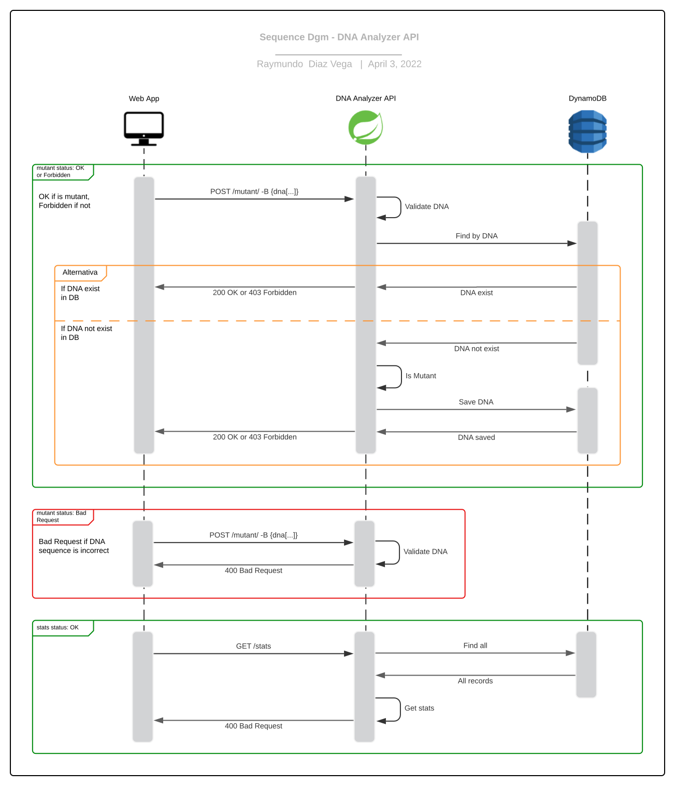

# DNA Analyzer API

| [](https://github.com/RayDiazVega/dna-analyzer-api/actions/workflows/pipeline.yml) |  |  |
|:-------------------------------------------------------------------------------------------------------------------------------------------------------------------------------------------------------------:|:--------------------------------------:|:----------------------------------------:|

API REST para identificar si un humano es mutante según su ADN y proveer estadísticas de las verificaciones de ADN.

- [Problema planteado](.github/docs/Examen_Mercadolibre_-_Mutantes.pdf)
- [Documentación de la API](http://dnaanalyzerapi-env.eba-pbepzfyx.sa-east-1.elasticbeanstalk.com/dna-analyzer-api/swagger-ui/index.html#/)
- [Colección de Postman](.github/docs/dna-analyzer-api.postman_collection.json)

## Instrucciones de ejecución

### Ejecución local

Instalar previamente las siguientes herramientas:

```text
Java 11
Maven 3.8.5
Git 2.35.1
Postman
```

Clonar el repositorio con el comando:
```sh
git clone https://github.com/RayDiazVega/dna-analyzer-api.git
```

En la carpeta del proyecto ejecutar los comandos:

```sh
mvn clean package
java -jar target/dna-analyzer-api-0.0.1-SNAPSHOT.jar
```

Abrir Postman, descargar e importar la
colección [dna-analyzer-api](.github/docs/dna-analyzer-api.postman_collection.json).

Si se quiere probar la API de manera local use los endpoints `POST /mutant/` y `GET /stats`  en la
carpeta localhost de la colección o ejecutar los siguientes comandos:

```sh
curl --location --request POST 'http://localhost:8080/dna-analyzer-api/mutant/' \
--header 'Content-Type: application/json' \
--data-raw '{
    "dna": [
        "ATGCGA",
        "CAGTGC",
        "TTATGT",
        "AGAAGG",
        "CCCCTA",
        "TCACTG"
    ]
}'
```
 ```sh
curl --location --request GET 'http://localhost:8080/dna-analyzer-api/stats'
```

También se puede probar de manera local accediendo al Swagger
en http://localhost:8080/dna-analyzer-api/swagger-ui/index.html#/

### Ejecución remota

Para probar la API hosteada en AWS usar los endpoints `POST /mutant/` y `GET /stats`  en la carpeta
AWS Endpoints de la colección o ejecutar los comandos anteriores cambiando `localhost:8080`
por `dnaanalyzerapi-env.eba-pbepzfyx.sa-east-1.elasticbeanstalk.com`:
```sh
curl --location --request POST 'http://dnaanalyzerapi-env.eba-pbepzfyx.sa-east-1.elasticbeanstalk.com/dna-analyzer-api/mutant/' \
--header 'Content-Type: application/json' \
--data-raw '{
    "dna": [
        "ATGCGA",
        "CAGTGC",
        "TTATGT",
        "AGAAGG",
        "CCCCTA",
        "TCACTG"
    ]
}'
```

 ```sh
curl --location --request GET 'http://dnaanalyzerapi-env.eba-pbepzfyx.sa-east-1.elasticbeanstalk.com/dna-analyzer-api/stats'
```

También se puede probar la API hosteada en AWS accediendo al Swagger
en http://dnaanalyzerapi-env.eba-pbepzfyx.sa-east-1.elasticbeanstalk.com/dna-analyzer-api/swagger-ui/index.html#/

### Operaciones

|  ENDPOINT  |              POST              |                   GET                   |
|:----------:|:------------------------------:|:---------------------------------------:|
| `/mutant/` | Valid DNA sequence, return 200 |         Not allowed, return 400         |
|  `/stats`  |    Not allowed, return 400     | Get verification statistics, return 200 |

## Pruebas

Se preparó un conjunto de pruebas unitarias en la ruta `src/test` con una cobertura del **84.3%**,
se pueden ejecutar las pruebas en la raíz del proyecto con el comando:

```sh
mvn test
```

Adicionalmente se realizó
una [prueba de carga](.github/docs/dna-analyzer-api.postman_load_testing.json) de 200 peticiones a
la API con un tiempo de respuesta promedio de 333.37 ms y en un tiempo total de 65.131 s.

### Resultados de monitoreo


## Arquitectura

### Diagrama de flujo



Se decidió utilizar Spring Boot, ya que facilita la creación de aplicaciones independientes basadas
en Spring Framework, ideales para desplegar en servicios como Elastic Beanstalk.

Para la creación del algoritmo se analizó cuidadosamente el problema y se desarrolló la siguiente
solución:

1. Inicialmente se valida la estructura del ADN, si no es correcta devuelve un `Bad Request`.
2. Si la estructura es correcta, se verifica si existe el ADN en base de datos, si existe devuelve
   inmediatamente la respuesta, `OK` si es mutante o `Forbidden` si no es mutante.
3. Si no existe en base de datos, se valida si es mutante de la siguiente forma:
    - Se recorre toda la secuencia de ADN buscando **secuencias de 4 letras iguales**.
    - Para una mayor eficacia, en cada ciclo se buscan secuencias de 4 letras iguales de 4 formas
      distintas:
        - Horizontal
        - Vertical
        - Oblicua de izquierda a derecha
        - Oblicua de derecha a izquierda
    - En cada ciclo se contabilizan la cantidad de secuencias de 4 letras iguales en cada forma.
    - Solo puede haber máximo **una** secuencia de 4 letras iguales en cada forma, si hay más de una
      secuencia de 4 letras iguales en alguna de las formas, no es mutante y devuelve `Forbidden`.
    - La cantidad total de secuencias de 4 letras iguales debe ser mayor a **uno**, si en total no
      hay más de una secuencias de 4 letras iguales, no es mutante y devuelve `Forbidden`.
4. Finalmente se guarda en base de datos en ADN y la validación, `true` si es mutante o `false` si
   no es mutante y se devuelve la respuesta, `OK` si es mutante o `Forbidden` si no es mutante.

### Diagramas del sistema


> Fuente de la imagen: https://medium.com/javarevisited/how-to-deploy-springboot-app-to-elastic-beanstalk-using-github-actions-ci-cd-30b4557b4fb8

Se utilizó [Github Actions](.github/workflows/pipeline.yml) para una mayor eficiencia al construir,
probar y desplegar la nueva versión a Elastic Beanstalk. Se carga el archivo en S3, se crea una
nueva versión en Elastic Beanstalk y se implementa esa versión en el entorno.


> Fuente de la imagen: https://dev.to/frosnerd/deploying-an-http-api-on-aws-using-elastic-beanstalk-5dh7

Se decidió utilizar Elastic Beanstalk, ya que permite implementar aplicaciones rápidamente, gestiona
automáticamente el aprovisionamiento de la capacidad, el equilibrio de carga, el escalado automático
y monitorización del estado de la aplicación. Reduce la complejidad de la administración y permite
concentrarse en el desarrollo de la aplicación.

Y como base de datos se utilizó DynamoDB, por su capacidad de autoescalado horizontal, es decir
escala automáticamente las tablas hacia arriba y hacia abajo para ajustar la capacidad y mantener el
rendimiento, permitiendo flexibilidad, disponibilidad y una latencia de milisegundos a cualquier
escala.

## Conclusión

Con esto se da cumplimiento a los entregables solicitados en el planteamiento:

- [x] [Codio fuente.](https://github.com/RayDiazVega/dna-analyzer-api)
- [x] [Instrucciones de cómo ejecutar el programa o la API.](#instrucciones-de-ejecución)
- [x] [Documentación de la arquitectura del proyecto, Cloud y las decisiones tomadas.](#arquitectura)
- [x] [URL de la API.](http://dnaanalyzerapi-env.eba-pbepzfyx.sa-east-1.elasticbeanstalk.com/dna-analyzer-api/swagger-ui/index.html#/)
